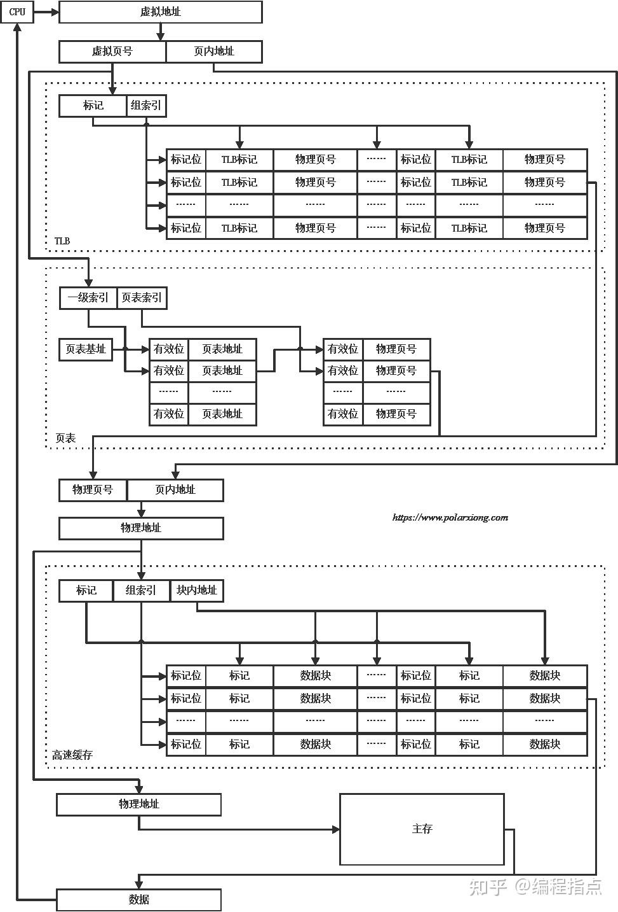

当我们将**虚拟内存**纳入考量时，CPU访问主存的过程变得更加复杂和精妙。虚拟内存是操作系统提供的一种抽象，它让每个进程都以为自己独占整个连续的地址空间（虚拟地址空间），而物理内存则由所有进程共享。CPU访问主存的完整流程就涉及到**虚拟地址到物理地址的转换**，这个过程主要由**内存管理单元**完成。以下是结合虚拟内存的详细步骤：

**核心组件：**
1.  **CPU：** 执行指令，生成**虚拟地址**。
2.  **MMU：** 集成在CPU或与CPU紧密相连的硬件单元，负责**虚拟地址到物理地址的转换**。其关键部件包括：
    *   **TLB：** 转换后备缓冲区，一个高速缓存，用于存储最近使用过的**虚拟页号->物理页帧号**的映射。
    *   **页表遍历单元：** 当TLB未命中时，负责从内存中读取页表项以完成地址转换。
3.  **页表：** 操作系统在物理内存中维护的数据结构，存储着进程的**虚拟页号**到**物理页帧号**的映射关系，以及重要的控制位（如存在位P、读写权限R/W、用户/内核权限U/S等）。现代系统通常使用**多级页表**来节省空间。
4.  **内存控制器：** 负责管理对物理DRAM的访问时序和协议（如前面所述）。
5.  **物理内存：** 实际的DRAM芯片。
6.  **操作系统：** 负责创建、维护页表，处理缺页异常，管理物理页帧的分配和回收，以及在需要时将页面从磁盘交换区调入物理内存。

**CPU访问主存（结合虚拟内存）的详细步骤：**

1.  **CPU生成虚拟地址：**
    *   CPU在执行指令（取指令、读写数据）时，根据程序逻辑生成一个**虚拟地址**。例如，`mov eax, [0x8048000]` 中的 `0x8048000` 就是一个虚拟地址。

2.  **虚拟地址拆分：**
    *   MMU将CPU生成的虚拟地址拆分为两部分：
        *   **虚拟页号：** 高位部分，用于在页表中查找对应的物理页帧号。
        *   **页内偏移：** 低位部分，直接对应物理页帧内的字节偏移量。转换后保持不变。

3.  **TLB查找：**
    *   MMU首先查询其内部的**TLB**。TLB存储着最近使用过的`(虚拟页号 -> 物理页帧号)`映射。
    *   **TLB命中：**
        *   如果在TLB中找到该虚拟页号的条目。
        *   MMU直接取出对应的**物理页帧号**。
        *   **跳转到第6步**（拼接物理地址）。
    *   **TLB未命中：**
        *   如果在TLB中未找到映射。
        *   MMU必须进行**页表遍历**以查找物理页帧号。
        *   **进入第4步**（页表查找）。

4.  **页表查找（页表遍历）：**
    *   MMU中的**页表遍历单元**开始工作。
    *   **获取页表基址：** CPU有一个特殊的寄存器（如x86的`CR3`寄存器，ARM的`TTBR0/TTBR1`），它指向当前进程**顶级页表**在物理内存中的基地址。操作系统在进程切换时会加载这个寄存器。
    *   **多级页表遍历（以x86-64的4级页表为例）：**
        *   MMU使用虚拟地址中的不同字段作为索引，逐级访问页表：
            1.  从`CR3`寄存器获取**PML4表**的物理基址。
            2.  使用虚拟地址的`PML4索引`字段，在PML4表中找到对应的**PML4条目**。该条目包含**页目录指针表**的物理基址。
            3.  使用虚拟地址的`页目录指针索引`字段，在页目录指针表中找到对应的**PDP条目**。该条目包含**页目录表**的物理基址。
            4.  使用虚拟地址的`页目录索引`字段，在页目录表中找到对应的**页目录条目**。该条目包含**页表**的物理基址。
            5.  使用虚拟地址的`页表索引`字段，在页表中找到最终的**页表条目**。
        *   每一级访问都需要一次物理内存访问（除非该级页表本身已被缓存）。
    *   **检查页表项：**
        *   找到最终的页表项后，MMU检查其关键标志位：
            *   **存在位：** 该位为`1`，表示该虚拟页当前映射到了物理内存中。
            *   **读写权限位：** 检查当前CPU模式（用户态/内核态）和操作类型（读/写）是否符合权限。
            *   **其他位：** 如用户/内核位、NX位（禁止执行）等。
        *   **权限检查失败：** 如果权限不足（如用户程序试图写入只读页或内核页），MMU会触发一个**段错误**或**访问违例异常**，CPU陷入内核，操作系统通常会终止进程。
        *   **存在位为0（缺页）：** 如果存在位为`0`，表示该虚拟页**没有**映射到物理内存。MMU触发一个**缺页异常**，CPU陷入内核。**进入第5步**（缺页处理）。
        *   **存在位为1（页命中）：**
            *   从页表项中提取**物理页帧号**。
            *   **更新TLB：** 将新获得的`(虚拟页号 -> 物理页帧号)`映射以及页表项中的权限位等信息，加载到TLB中，供后续快速访问。
            *   **进入第6步**（拼接物理地址）。

5.  **处理缺页异常：**
    *   CPU因缺页异常陷入操作系统内核。
    *   **内核缺页处理程序：**
        1.  检查导致缺页的虚拟地址是否属于当前进程的有效地址空间（是否在某个VMA中）。如果不是，通常终止进程（段错误）。
        2.  检查访问类型是否符合该虚拟内存区域的权限（如尝试写入只读区域）。如果不符合，终止进程（段错误）。
        3.  **分配物理页帧：** 内核从物理内存的空闲页帧池中分配一个**空闲的物理页帧**。如果物理内存已满，则需要使用页面置换算法（如LRU）选择一个“牺牲”页面换出。
        4.  **准备页面内容：**
            *   如果是**文件映射页**（如代码段、内存映射文件），内核调度I/O操作，从磁盘上的文件读取所需内容到新分配的物理页帧。
            *   如果是**匿名页**（如堆、栈），内核通常直接将新分配的物理页帧**清零**（提供初始零值）。
            *   如果是被换出的页面（`swap`），内核需要调度I/O操作，从**交换区**（磁盘上的swap分区或文件）将该页的内容读回新分配的物理页帧（如果之前换出过）。
        5.  **更新页表：**
            *   内核修改进程的页表项：将**物理页帧号**写入页表项，将**存在位**设为`1`，设置正确的权限位等。
            *   可能需要更新多级页表中的多个条目。
        6.  **刷新TLB：** 内核执行一条特殊的指令（如x86的`invlpg`指令或刷新整个TLB），使TLB中可能存在的旧的/无效的映射失效，确保新的映射生效。
        7.  **返回用户态：** 缺页处理程序执行完毕，CPU返回到触发缺页的那条用户指令重新执行。

6.  **拼接物理地址：**
    *   一旦MMU通过TLB或页表遍历获得了**物理页帧号**（无论是直接获得还是通过缺页处理后获得），它将物理页帧号与原始虚拟地址中的**页内偏移**部分拼接起来，形成最终的**物理地址**。

7.  **访问物理内存（DRAM）：**
    *   现在，MMU将拼接好的**物理地址**发送给**内存控制器**。
    *   后续步骤与**不涉及虚拟内存**时CPU访问物理内存的过程**完全相同**（如前文所述）：
        *   内存控制器接收物理地址和控制信号（读/写）。
        *   内存控制器将物理地址拆解为DRAM的行地址和列地址。
        *   内存控制器按照精确的DRAM时序（RAS#, CAS#, WE#等）与DRAM芯片交互。
        *   对于读操作：数据从DRAM读出，通过数据总线传回内存控制器，最终交给CPU（并可能缓存到CPU Cache）。
        *   对于写操作：数据从CPU通过数据总线传给内存控制器，内存控制器将其写入DRAM指定位置。
    *   CPU完成此次内存访问。

**关键点总结与虚拟内存的意义：**

*   **核心机制：** MMU通过TLB和页表完成**虚拟地址->物理地址**的转换。TLB是高速缓存，页表是存储在物理内存中的权威映射。
*   **缺页处理：** 当所需页面不在物理内存时，由操作系统通过缺页异常处理程序介入，负责将页面调入物理内存并更新页表，然后让程序继续执行。这使得**按需调页**成为可能。
*   **虚拟内存的好处：**
    *   **地址空间隔离：** 每个进程拥有独立的虚拟地址空间，互不干扰，提高安全性和稳定性。
    *   **简化编程：** 程序员和编译器无需关心物理内存的实际布局和限制。
    *   **更大的地址空间：** 虚拟地址空间可以远大于物理内存容量（利用磁盘作为后备存储）。
    *   **内存共享：** 不同进程可以映射到相同的物理页（如共享库、进程间通信），节省内存。
    *   **高效的内存管理：** 操作系统可以灵活地分配、回收、移动物理页帧，实现按需调页和页面置换。
*   **性能开销：**
    *   **TLB命中：** 转换非常快（通常1-3个CPU周期）。
    *   **TLB未命中但页命中：** 需要访问物理内存中的页表（多级页表可能需要多次访存），开销大（几十到上百纳秒）。
    *   **缺页：** 需要操作系统介入，涉及磁盘I/O，开销巨大（毫秒级，百万倍于CPU周期）。
*   **优化：**
    *   **大页：** 使用更大的页面大小（如2MB, 1GB）可以减少TLB条目需求，降低TLB未命中率和页表遍历开销。
    *   **ASID/PCID：** 在TLB条目中标记进程ID，避免进程切换时频繁刷新整个TLB。
    *   **缓存：** CPU Cache缓存的是物理地址对应的数据。页表本身也可能被CPU Cache缓存，加速页表遍历。

**简单来说（结合虚拟内存）：**
1.  CPU说：“我要访问虚拟地址VA”。
2.  MMU问TLB：“VA对应的物理地址PA是啥？” (快查)。
3.  TLB说：“我知道！PA=XXX”。(TLB命中) -> 跳到第6步。
4.  TLB说：“我不知道”。(TLB未命中) -> MMU查内存中的页表：“VA对应的PA是啥？”。
5.  页表说：
    *   “PA=YYY，页在内存里” (页命中) -> MMU更新TLB -> 跳到第6步。
    *   “页不在内存里！” (缺页) -> CPU喊操作系统：“快处理缺页！”。
    *   操作系统忙活：分配物理页、读磁盘数据、更新页表、刷新TLB。
    *   操作系统对CPU说：“好了，你重试吧”。CPU重新执行指令 -> 回到第1步（这次页肯定在了）。
6.  MMU拿到物理地址PA = (物理页帧号 + 页内偏移)。
7.  CPU/内存控制器按PA去访问物理DRAM（和之前流程一样）。

虚拟内存机制极大地增强了内存管理的灵活性和程序的安全性，是现代操作系统的基石，但其转换过程也引入了额外的复杂性和潜在的性能开销（尤其是TLB未命中和缺页异常），因此硬件（TLB, 大页）和软件（页面置换算法）的优化至关重要。