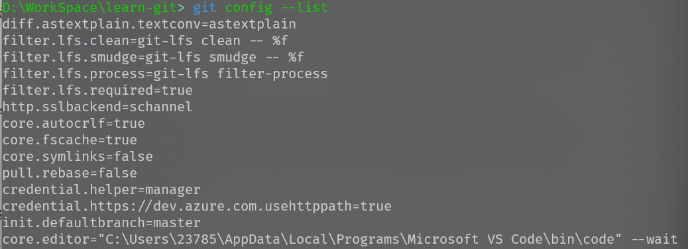
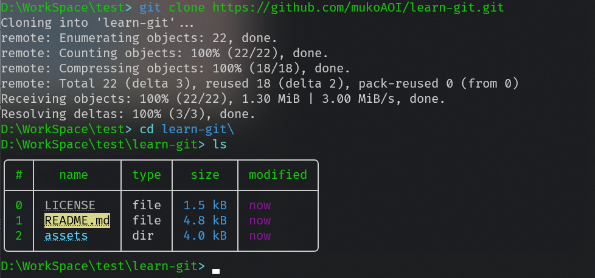
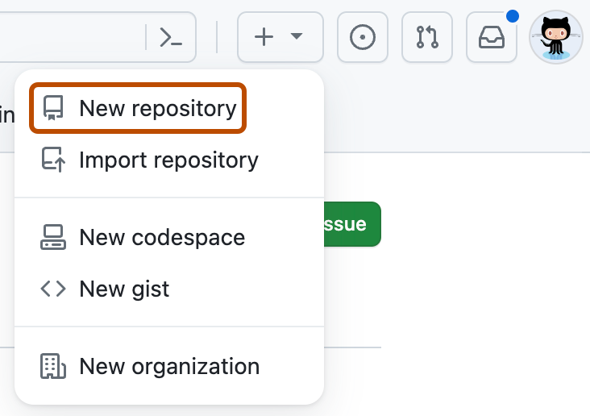
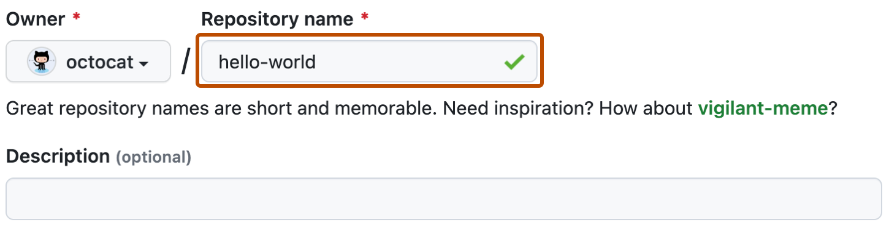

# learn-git
为了完成git的作业


## Git 工作目录（Working Directory）、暂存区(Stage/Index)、资源库(Repository或Git Directory)、git仓库(Remote Directory)


- 图中左侧为工作区，右侧为版本库。在版本库中标记为 "index" 的区域是暂存区（stage/index），标记为 "master" 的是 master 分支所代表的目录树。
- 图中我们可以看出此时 "HEAD" 实际是指向 master 分支的一个"游标"。所以图示的命令中出现 HEAD 的地方可以用 master 来替换。
- 图中的 objects 标识的区域为 Git 的对象库，实际位于 ".git/objects" 目录下，里面包含了创建的各种对象及内容。
- 当对工作区修改（或新增）的文件执行 **git add** 命令时，暂存区的目录树被更新，同时工作区修改（或新增）的文件内容被写入到对象库中的一个新的对象中，而该对象的ID被记录在暂存区的文件索引中。
- 当执行提交操作（git commit）时，暂存区的目录树写到版本库（对象库）中，master 分支会做相应的更新。即 master 指向的目录树就是提交时暂存区的目录树。
- 当执行 **git reset HEAD** 命令时，暂存区的目录树会被重写，被 master 分支指向的目录树所替换，但是工作区不受影响。
- 当执行 **git rm --cached <file>** 命令时，会直接从暂存区删除文件，工作区则不做出改变。


**Workspace**： 工作区，就是你平时存放项目代码的地方，进行文件的创建、修改和删除操作。工作区包含了当前项目的所有文件和子目录，显示的是项目目前的状态，这个状态还没有记录到版本控制中

**Index / Stage**： 暂存区，用于临时存放你的改动，事实上它只是一个文件，保存即将提交到文件列表信息，一般存放在.git目录下的index文件，保存了将被包括在下一个提交的更改

**Repository**： 仓库区（或版本库），就是安全存放数据的位置，这里面有你提交到所有版本的数据。版本库包含项目的所有版本历史记录，每次提交都会在版本库中创建一个新的快照，这些快照是不可变的，确保项目的完整历史，分为本地版本库和远程版本库，这里指的是本地版本库，位于./git 目录下面，包含了所有提交的对象和引用

**Remote**： 远程仓库，托管代码的服务器，可以简单的认为是你项目组中的一台电脑用于远程数据交换

本地的仓库维护三个部分，第一个是工作目录Workspace，第二个是暂存区Index/Stage临时保存改动,第三个是HEAD指向最后一次提交的结果（当执行 **git checkout .** 或者 **git checkout -- <file>** 命令时，会用暂存区全部或指定的文件替换工作区的文件。这个操作很危险，会清除工作区中未添加到暂存区中的改动。当执行 **git checkout HEAD .** 或者 **git checkout HEAD <file>** 命令时，会用 HEAD 指向的 master 分支中的全部或者部分文件替换暂存区和以及工作区中的文件。这个命令也是极具危险性的，因为不但会清除工作区中未提交的改动，也会清除暂存区中未提交的改动。）


**Untracked:**  未跟踪, 此文件在文件夹中, 但并没有加入到git库, 不参与版本控制. 通过git add 状态变为Staged.

**Unmodify:**  文件已经入库, 未修改, 即版本库中的文件快照内容与文件夹中完全一致. 这种类型的文件有两种去处, 如果它被修改, 而变为Modified.如果使用git rm移出版本库, 则成为Untracked文件

**Modified:** 文件已修改, 仅仅是修改, 并没有进行其他的操作. 这个文件也有两个去处, 通过git add可进入暂存staged状态, 使用git checkout 则丢弃修改过,返回到unmodify状态, 这个git checkout即从库中取出文件, 覆盖当前修改

 **Staged:** 暂存状态. 执行git commit则将修改同步到库中, 这时库中的文件和本地文件又变为一致, 文件为Unmodify状态. 执行git reset HEAD filename取消暂存,文件状态为Modified

## 使用教程

### 安装教程

​	git 官方安装教程 https://git-scm.com/book/en/v2/Getting-Started-Installing-Git

### git基础操作

#### 设置

```bash
git config 
	-e 编辑当前仓库配置文件
	--list 列举git的配置
	--global 添加这个可以全局设置git，如果去掉，只对当前仓库起作用
		git config --global user.name "xxxxx"
		git config --global user.email "xxxxx@xxxxx.xxxxx"
		
```



#### 克隆仓库

```bash
git clone <repo> 
git clone <repo> <dir> //指定对应的路径
```



#### 创建本地仓库

```bash
git init dir  //使用git
jj git init dir//使用jujustu
```


#### 文件操作

Git的工作是创建保存对项目的修改增删修改，


#### 创建仓库命令

下表列出了 git 创建仓库的命令：

| 命令        | 说明                                   |
| :---------- | :------------------------------------- |
| `git init`  | 初始化仓库                             |
| `git clone` | 拷贝一份远程仓库，也就是下载一个项目。 |

------

#### 提交与修改

Git 的工作就是创建和保存你的项目的快照及与之后的快照进行对比。

下表列出了有关创建与提交你的项目的快照的命令：

| 命令                                | 说明                                     |
| :---------------------------------- | :--------------------------------------- |
| `git add`                           | 添加文件到暂存区                         |
| `git status`                        | 查看仓库当前的状态，显示有变更的文件。   |
| `git diff`                          | 比较文件的不同，即暂存区和工作区的差异。 |
| `git difftool`                      | 使用外部差异工具查看和比较文件的更改。   |
| `git range-diff`                    | 比较两个提交范围之间的差异。             |
| `git commit`                        | 提交暂存区到本地仓库。                   |
| `git reset`                         | 回退版本。                               |
| `git rm`                            | 将文件从暂存区和工作区中删除。           |
| `git mv`                            | 移动或重命名工作区文件。                 |
| `git notes`                         | 添加注释。                               |
| `git checkout`                      | 分支切换。                               |
| `git switch （Git 2.23 版本引入）`  | 更清晰地切换分支。                       |
| `git restore （Git 2.23 版本引入）` | 恢复或撤销文件的更改。                   |
| `git show`                          | 显示 Git 对象的详细信息。                |

### 提交日志

| 命令               | 说明                                                         |
| :----------------- | :----------------------------------------------------------- |
| `git log`          | 查看历史提交记录                                             |
| `git blame <file>` | 以列表形式查看指定文件的历史修改记录                         |
| `git shortlog`     | 生成简洁的提交日志摘要                                       |
| `git describe`     | 生成一个可读的字符串，该字符串基于 Git 的标签系统来描述当前的提交 |

### 远程操作

| 命令            | 说明                        |
| :-------------- | :-------------------------- |
| `git remote`    | 远程仓库操作                |
| `git fetch`     | 从远程获取代码库            |
| `git pull`      | 下载远程代码并合并          |
| `git push`      | 上传远程代码并合并          |
| `git submodule` | 管理包含其他 Git 仓库的项目 |

## 创建管理一个Github 仓库

官方参考

https://docs.github.com/zh/repositories/creating-and-managing-repositories/quickstart-for-repositories

##### 1.使用网页版

1. 在任何页面的右上角，选择 ，然后单击“新建存储库”。

   

   

   

2. 为存储库键入简短好记的名称。 例如 "hello-world"。

   

   

   

3. 可以选择性地添加存储库的说明。 例如，“我在 GitHub 上的第一个存储库”。

4. 选择仓库可见性。 有关详细信息，请参阅“[关于仓库](https://docs.github.com/zh/repositories/creating-and-managing-repositories/about-repositories#about-repository-visibility)”。

5. 选择“使用 README 初始化此存储库”。

6. 单击“创建存储库”。

恭喜！ 你已经成功创建了第一个存储库，并使用自述文件对其进行了初始化。

##### 2.使用命令行工具

​	pass 自行了解

#### 本地管理github

```bash
//配置好git
git config --global user.name ""
git config --global user.email ""

git clone 指定的库

cd yourrepo

//修改文件

git add 文件

git commit -m "注释/提醒"

git push origin master

```

```
//或者
//配置好git
git config --global user.name ""
git config --global user.email ""

git init yourrepo

cd yourrepo

git remote add origin your-repo-url

git pull

git checkout 指定分支

//修改文件

git add 文件

git commit -m "注释/提醒"

git push origin master
```


## 参考

https://www.runoob.com/git

https://www.runoob.com/w3cnote/git-guide.html

https://www.cnblogs.com/qdhxhz/p/9757390.html
