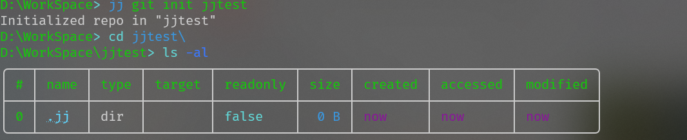

# learn-git
为了完成git的作业


## Git 工作目录（Working Directory）、暂存区(Stage/Index)、资源库(Repository或Git Directory)、git仓库(Remote Directory)


- 图中左侧为工作区，右侧为版本库。在版本库中标记为 "index" 的区域是暂存区（stage/index），标记为 "master" 的是 master 分支所代表的目录树。
- 图中我们可以看出此时 "HEAD" 实际是指向 master 分支的一个"游标"。所以图示的命令中出现 HEAD 的地方可以用 master 来替换。
- 图中的 objects 标识的区域为 Git 的对象库，实际位于 ".git/objects" 目录下，里面包含了创建的各种对象及内容。
- 当对工作区修改（或新增）的文件执行 **git add** 命令时，暂存区的目录树被更新，同时工作区修改（或新增）的文件内容被写入到对象库中的一个新的对象中，而该对象的ID被记录在暂存区的文件索引中。
- 当执行提交操作（git commit）时，暂存区的目录树写到版本库（对象库）中，master 分支会做相应的更新。即 master 指向的目录树就是提交时暂存区的目录树。
- 当执行 **git reset HEAD** 命令时，暂存区的目录树会被重写，被 master 分支指向的目录树所替换，但是工作区不受影响。
- 当执行 **git rm --cached <file>** 命令时，会直接从暂存区删除文件，工作区则不做出改变。


**Workspace**： 工作区，就是你平时存放项目代码的地方，进行文件的创建、修改和删除操作。工作区包含了当前项目的所有文件和子目录，显示的是项目目前的状态，这个状态还没有记录到版本控制中

**Index / Stage**： 暂存区，用于临时存放你的改动，事实上它只是一个文件，保存即将提交到文件列表信息，一般存放在.git目录下的index文件，保存了将被包括在下一个提交的更改

**Repository**： 仓库区（或版本库），就是安全存放数据的位置，这里面有你提交到所有版本的数据。版本库包含项目的所有版本历史记录，每次提交都会在版本库中创建一个新的快照，这些快照是不可变的，确保项目的完整历史，分为本地版本库和远程版本库，这里指的是本地版本库，位于./git 目录下面，包含了所有提交的对象和引用

**Remote**： 远程仓库，托管代码的服务器，可以简单的认为是你项目组中的一台电脑用于远程数据交换

本地的仓库维护三个部分，第一个是工作目录Workspace，第二个是暂存区Index/Stage临时保存改动,第三个是HEAD指向最后一次提交的结果（当执行 **git checkout .** 或者 **git checkout -- <file>** 命令时，会用暂存区全部或指定的文件替换工作区的文件。这个操作很危险，会清除工作区中未添加到暂存区中的改动。当执行 **git checkout HEAD .** 或者 **git checkout HEAD <file>** 命令时，会用 HEAD 指向的 master 分支中的全部或者部分文件替换暂存区和以及工作区中的文件。这个命令也是极具危险性的，因为不但会清除工作区中未提交的改动，也会清除暂存区中未提交的改动。）


**Untracked:**  未跟踪, 此文件在文件夹中, 但并没有加入到git库, 不参与版本控制. 通过git add 状态变为Staged.

**Unmodify:**  文件已经入库, 未修改, 即版本库中的文件快照内容与文件夹中完全一致. 这种类型的文件有两种去处, 如果它被修改, 而变为Modified.如果使用git rm移出版本库, 则成为Untracked文件

**Modified:** 文件已修改, 仅仅是修改, 并没有进行其他的操作. 这个文件也有两个去处, 通过git add可进入暂存staged状态, 使用git checkout 则丢弃修改过,返回到unmodify状态, 这个git checkout即从库中取出文件, 覆盖当前修改

 **Staged:** 暂存状态. 执行git commit则将修改同步到库中, 这时库中的文件和本地文件又变为一致, 文件为Unmodify状态. 执行git reset HEAD filename取消暂存,文件状态为Modified


## 使用教程

### 安装教程

​	git 官方安装教程 https://git-scm.com/book/en/v2/Getting-Started-Installing-Git

​	

### 创建一个仓库

```bash
git init dir  //使用git
jj git init dir//使用jujustu
```




https://www.runoob.com/git

https://www.runoob.com/w3cnote/git-guide.html

https://www.cnblogs.com/qdhxhz/p/9757390.html
