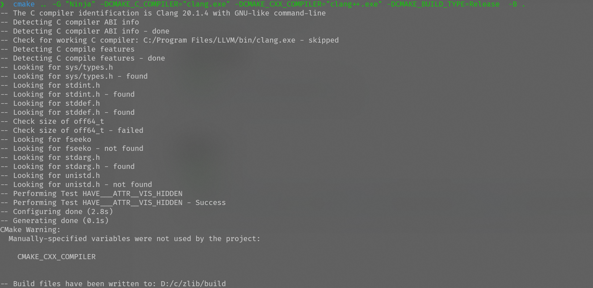
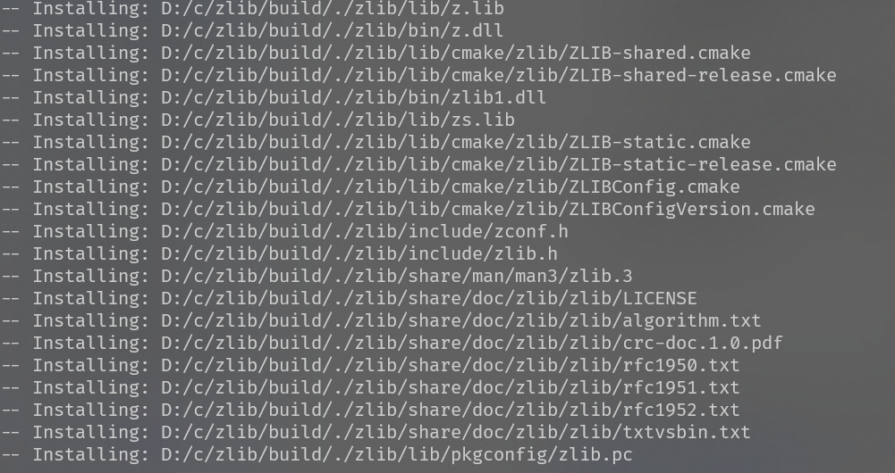
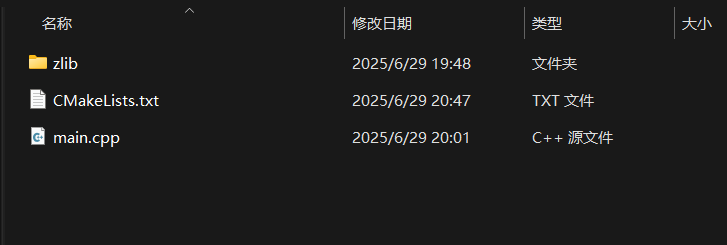
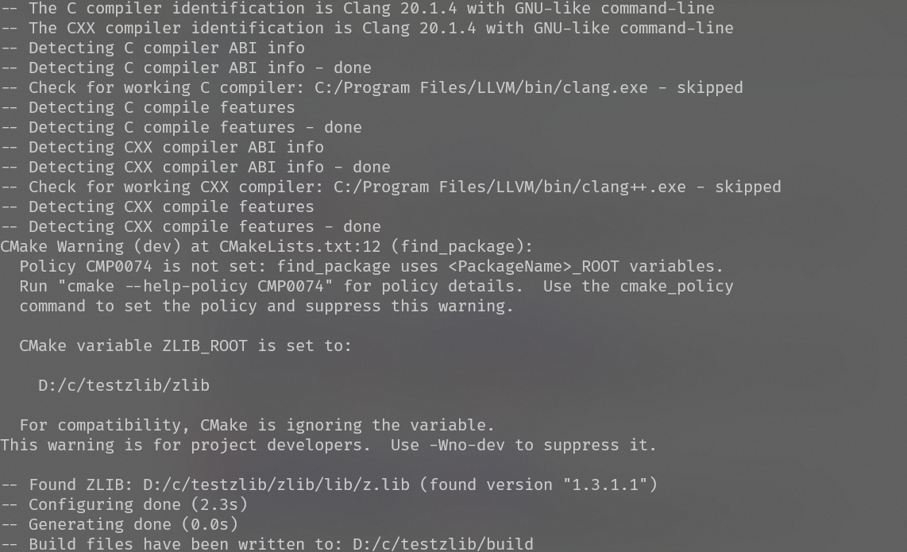
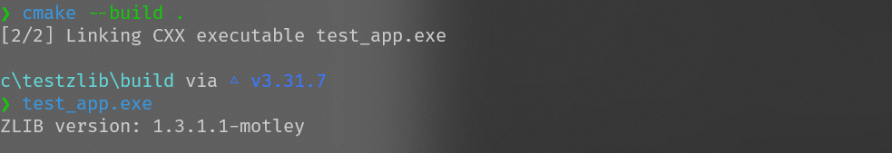

# 如何在Windows上使用Cmake+LLVM+ninja编译使用zlib（基础入门）


1. #### 安装必要工具：

   - [LLVM for Windows](https://github.com/llvm/llvm-project/releases)（选择 `.exe` 安装包）

   - [CMake](https://cmake.org/download/)

   - [Visual Studio Build Tools](https://visualstudio.microsoft.com/downloads/#build-tools-for-visual-studio-2022)（勾选 "C++ 构建工具"）

   - [ninja](https://ninja-build.org/)

     也可使用winget 安装ninja ，日常使用msvc编译的时候使用的visual studio 附带的nmake

```powershell
winget install Ninja-build.Ninja
```


2. #### 下载zlib源码

   ```
   git clone https://github.com/madler/zlib.git
   cd zlib
   ```

   

3. #### 编译zlib

   ```cmd
   mkdir build
   cd build
   cmake .. -G "Ninja" -DCMAKE_C_COMPILER="clang.exe" -DCMAKE_CXX_COMPILER="clang++.exe" -DCMAKE_BUILD_TYPE=Release  -B .
   //等待生成
   cmake --build . --config Release
   
   
   ```

   

```cmd
//编译结果
├─CMakeFiles
│  ├─3.31.7
│  │  └─CompilerIdC
│  │      └─tmp
│  ├─CMakeScratch
│  ├─Export
│  │  └─93f1ef598f1f2f8b07b376ab081bbce6
│  ├─pkgRedirects
│  ├─ShowIncludes
│  ├─zlib.dir
│  │  └─win32
│  └─zlibstatic.dir
└─test
    ├─add_subdirectory_exclude_test
    ├─add_subdirectory_test
    ├─CMakeFiles
    │  ├─infcover.dir
    │  ├─minigzip.dir
    │  ├─static_minigzip.dir
    │  ├─zlib_example.dir
    │  └─zlib_static_example.dir
    └─findpackage_test
```


4. #### 安装库

   ```cmd
   cmake --install . --prefix "./zlib" --config Release
   //  ./zlib 替换成自己的路径
   ```

   

5. #### 测试样例

文件结构




```cpp
//main.cpp
#include <iostream>
#include <zlib.h>

int main() {
    std::cout << "ZLIB version: " << zlibVersion() << std::endl;
    return 0;
}

```

```cmake
# CMakeLists.txt

cmake_minimum_required(VERSION 3.10)
project(ZlibTest)

#设置编译器
set(CMAKE_CXX_COMPILER clang++)
set(CMAKE_C_COMPILER clang)

# 设置 zlib 路径
set(ZLIB_ROOT ${CMAKE_CURRENT_SOURCE_DIR}/zlib)
set(CMAKE_PREFIX_PATH ${ZLIB_ROOT})

# 查找 zlib
find_package(ZLIB REQUIRED)

add_executable(test_app main.cpp)
target_link_libraries(test_app PRIVATE ZLIB::ZLIB)

#把对应动态库移动到编译输出的文件夹
add_custom_command(TARGET test_app POST_BUILD
    COMMAND ${CMAKE_COMMAND} -E copy_if_different
        "${CMAKE_SOURCE_DIR}/zlib/bin/z.dll"
        $<TARGET_FILE_DIR:test_app>
)

```

```cmd
//开始编译

mkdir build
cd build 
cmake .. -G "Ninja" -B .

cmake --build . 

./test_app.exe
```



