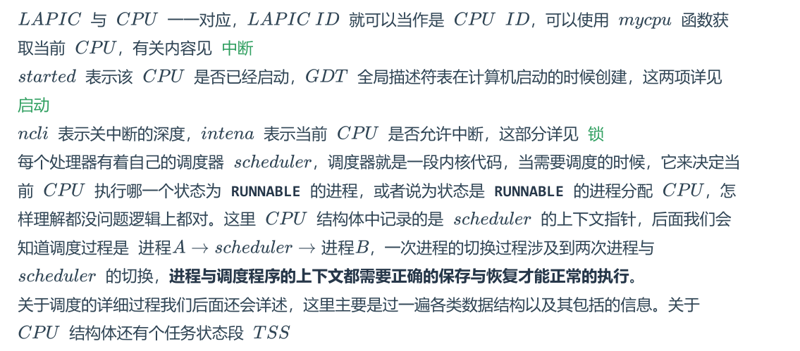

高级调度

中级调度

初级调度--->初级调度是进程调度


**PCB中记录了进程运行需要的一切环境和信息**

```c
//
// PCB 实现
//

struct proc {
uint sz;
// Size of process memory (bytes)进程大小
pde_t* pgdir;
// Page table 页表
char *kstack;
// Bottom of kernel stack for this process 内核栈
位置
enum procstate state;
// Process state 程序状态
int pid;
// Process ID 进程ID
struct proc *parent;
// Parent process 父进程指针
struct trapframe *tf;
// Trap frame for current syscall 中断栈帧指针
struct context *context;
// swtch() here to run process 上下文指针
void *chan;
// If non-zero, sleeping on chan 用来睡眠
int killed;
// If non-zero, have been killed 是否被killed
struct file *ofile[NOFILE];
// Open files 打开文件描述符表
struct inode *cwd;
// Current directory 当前工作路径
char name[16];
// Process name (debugging) 进程名字
};
```

所有的进程表

```C
struct {
struct spinlock lock;
struct proc proc[NPROC];//每个进程分配一个PCB
} ptable;
#define NPROC 64
// 最大进程数
//进程结构体表是一个全局的数据，配了一把锁，这把锁主要用来保护进程的状态和上下文
```


对于每一个CPU的描述

```C
/******proc.h*******/
struct cpu {
uchar apicid;
// LAPIC ID
struct context *scheduler;
// 调度器的上下文
struct taskstate ts;
// 任务状态段
struct segdesc $GDT$[NSEGS];
// $GDT$
volatile uint started;
// $CPU$是否已经启动
int ncli;
// 关中断深度
int intena;
// 该$CPU$是否允许中断
struct proc *proc;
// 运行在该$CPU$上的进程指针
};
/******mp.c*******/
struct cpu cpus[NCPU];
/******param.h*******/
#define NCPU 8
// 支持的最大$CPU$数
```



关中断的深度是什么？？？？？？？？？？？


调度算法：先来先服务，最短进程优先，最短剩余时间优先，最高优先级，高相应比优先，时间片轮转，多级反馈队列