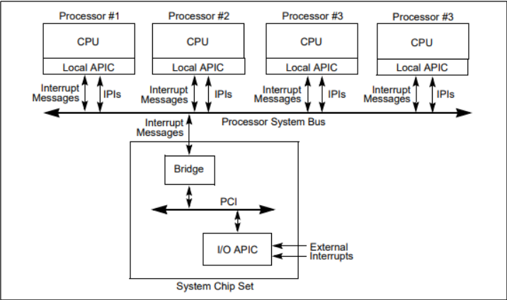

更高级的中断控制器APIC 

**PIC** 传统的中断控制器，只用于单处理器，多核处理器并不适用。

**APIC**（Advanced Programmable Interrupt Controller）高级可编程中断控制器，**APIC分成两部分LAPIC和I/OAPIC**,前者**LAPIC位于CPU内部**，每个CPU都有一个LAPIC**,I/OAPIC则是与外设相连**，外设发出的中断信号经过IOAPIC处理之后再发送给LAPIC，再有LAPIC决定是否交由CPU进行实际的中断处理。

每个**CPU**上有一个 **LAPIC** ， **I/OAPIC** 是系统芯片组一部分，各个中断消息通过总线发送接收。

中断是一个软硬协同的过程

CPU+OS

