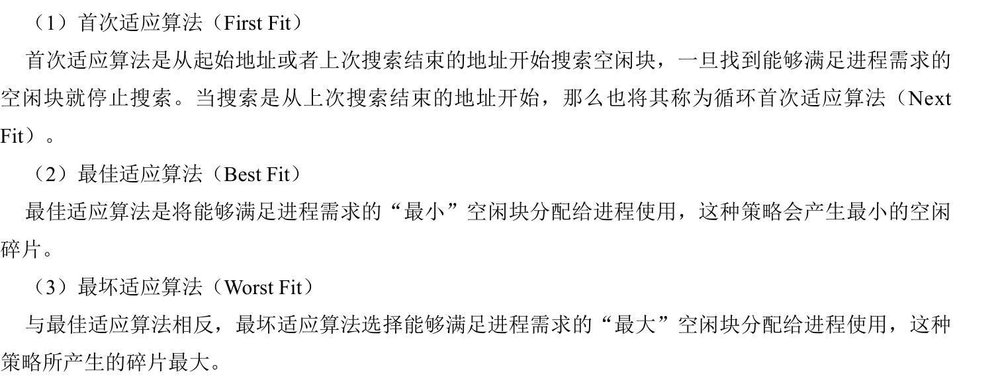

### 存储器管理概述

### 无抽象的存储器

无抽象的存储器如何实现并发

1.多线程编程

2.动态交换，把运行的从磁盘加载到内存之中，交换处理器资源的时候把程序保存在磁盘之中

3.通过特定的硬件支持

### 连续的内存分配

1.固定分区分配

​	等分区，不等分区

​	提出内部碎片的概念，即固定分配的大小不一定用的上，但是不能分配给其他的进程

2.动态分区分配

​	外部碎片

	针对外部碎片的处理方式通常采用紧致（compaction）。所谓紧致，指的是操作系统不断地移动进程，将进程的存储连续存放，使得空闲内存形成一个连续的存储区域

### 地址空间的抽象

内存定位有三种方式：绝对地址、静态重定位和动态重定位。 

（1）绝对地址 使用绝对地址是最简单的定位方式。例如在一个程序中，执行JMP 28就会跳转到内存的28号存储单元。无论程序在内存中的什么位置都是如此。显然这种定位方式不允许内存中同时存在两个程序，否则一个程序的程序计数器很可能会跳转到另一个程序的空间中。 （2）静态重定位 静态重定位的处理方法为在加载程序到内存中时，将程序中所有的地址都加上在内存中的起始地址。比如一个程序被加载到从1000号开始的内存空间，而且程序中有一条指令JMP 28，那么程序被加载入内存后这条指令会变成 JMP 1028。静态重定位的难点在于区分程序中哪些值是常量，哪些值是地址。

（3）动态重定位 使用动态重定位的cpu有两个特殊的寄存器：基址寄存器和界限寄存器。当一个进程运行时，程序的起始地址被装载到基址寄存器中，程序的长度被装载到界限寄存器中。当程序要进行内存操作时，cpu会首先将指令中的地址加上基址寄存器中的地址，再把地址送到内存总线。此外，cpu还会检查地址是否大于界限寄存器中的值。如果访问的地址超出了界限则会出错并停止访问。

### 分段存储管理

1. 文本段

   这是有编译器创建的，用于程序执行的代码或者机器指令，一般标记为只读，程序在运行过程之中是不能修改代码的，通常允许多个相同程序的进程之中共享

2. 数据段

   包括预定义的数据结构，可能是在程序开始执行之前就被初始化，通常有编译器创造

3. 堆

   堆是用作动态内存分配池的一个内存区域。它通常用于动态创建数据结构的应用程序中。例如，在C语言中，堆可以通过使用malloc系统函数来获取。反过来，malloc的实现为了扩大所需的堆需要向操作系统进行申请。在Linux系统中，它通过使用brk系统调用来实现。

4. 栈

   栈是用于存储程序所调用的函数的运行框的内存区域。这样的框包含存储的寄存器值以及用于存储局部变量的空间。存储和装载寄存器通过硬件完成，硬件将其作为调用函数以及函数返回的指令的一部分。此外，栈也是在运行时按需扩展的。

### 分页存储管理

### 段页式存储管理