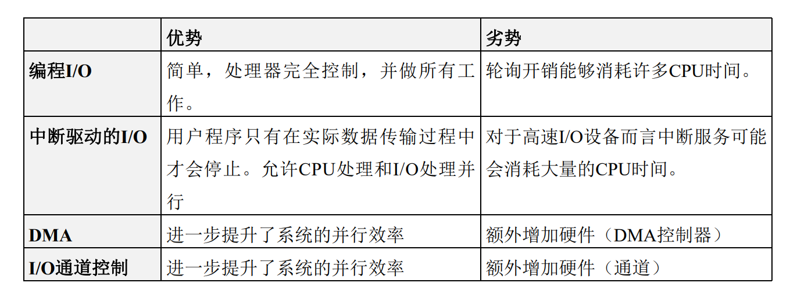
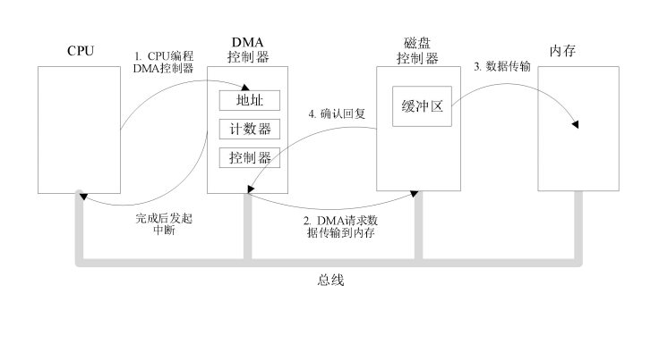

除了对进程、存储等提供抽象之外，操作系统也控制计算机得所有I/O（输入/输出）设备。操作系统必须向设备发出命令，捕获中断，处理错误等。它也应该为设备和系统的其他部分提供易于使用的接口。这个接口也应该是设备独立的，即对于所有设备基本上保持一致。

**I/O 系统**包括用于实现信息输入、输出和存储功能的设备和相应的设备控制器，在有的大、中型机中，还有I/O 通道或I/O 处理机。设备管理的对象主要是I/O 设备，还可能要涉及到设备控制器和I/O通道。而设备管理的基本任务是完成用户提出的I/O 请求，提高I/O 速率以及提高I/O 设备的利用率。设备管理的主要功能有：缓冲区管理、设备分配、设备处理、虚拟设备及实现设备独立性等。

#### 编程输入输出PI/O

**编程输入/输出（PIO）**是一种在**CPU**和**外围设备**（如网络适配器或ATA存储设备）之间**传输数据**的方法。每个数据项传输由程序中的指令启动，**每个事务都涉及CPU**。PIO是CPU在**驱动程序软件控制下发起的数据传输**，用于访问**设备上的寄存器或存储器**。

首先CPU 的速度远远快于要访问的设备，当发出指令需要读入读出数据的时候需要频繁的询问是否完成了I/O 

由于**CPU比I/O模块快**，因此编程I/O的问题是CPU必须等待很长时间才能使相关I/O模块准备好接收或传输数据。 **CPU在等待时必须反复检查I/O模块的状态，此过程称为轮询（Polling）**。结果，系统的整体性能水平严重下降。

工作方式：

1) CPU请求I/O操作 2) I/O模块执行操作 3) I/O模块设置状态位 4) CPU定期检查状态位 5) I/O模块不直接通知CPU 6) I/O模块不会中断CPU 7) CPU可能会等待或稍后再回来

1.PIO 编程方式的输入输出

cpu请求I/O操作

cpu请求I/O操作

I/O模块执行操作

I/o模块设置状态位

cpu定期检查状态位

I/O模块不会直接·通知cpu

I/O模块不会中断CPU

CPU可能会等候或稍后再回来

2.中断驱动I/O方式

CPU I/O阻塞

可以把cpu交给其他的进程从而提高效率

3.直接存储器访问I/O方式DMA

1) 数据传输的基本单位是数据块，即在CPU与I/O 设备之间，传送至少一个数据块；2) 所传送的数据是从设备直接送入内存的，或者相反； 3) 仅在传送一个或多个数据块的开始和结束时，才需CPU干预，整块数据的传送是在控制器的控制下完成的。

4. I/Ot通道控制方式

虽然

### 缓冲管理

